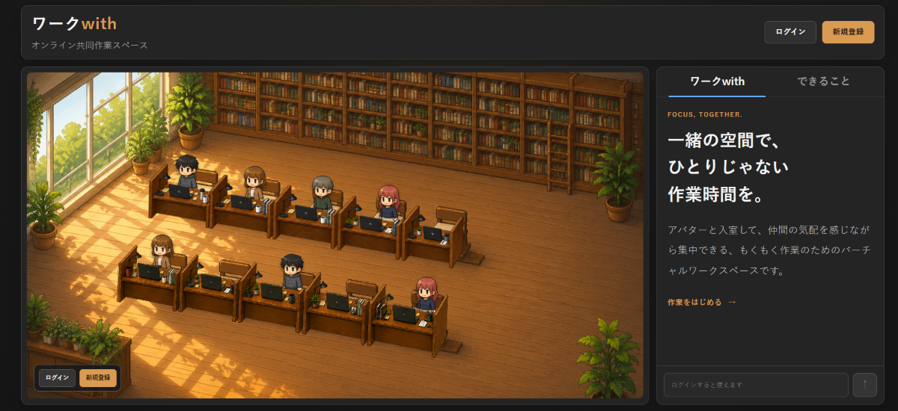
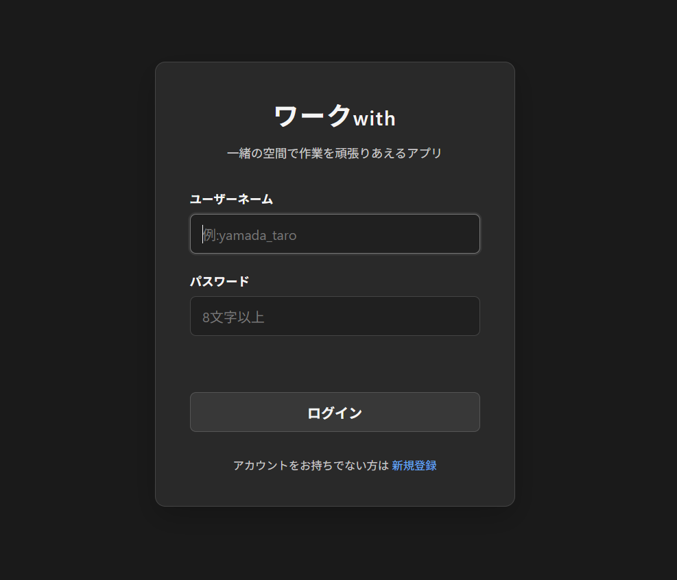
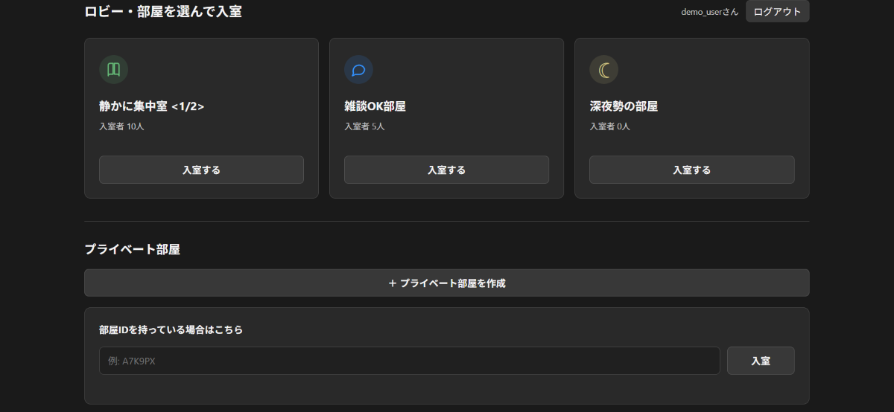
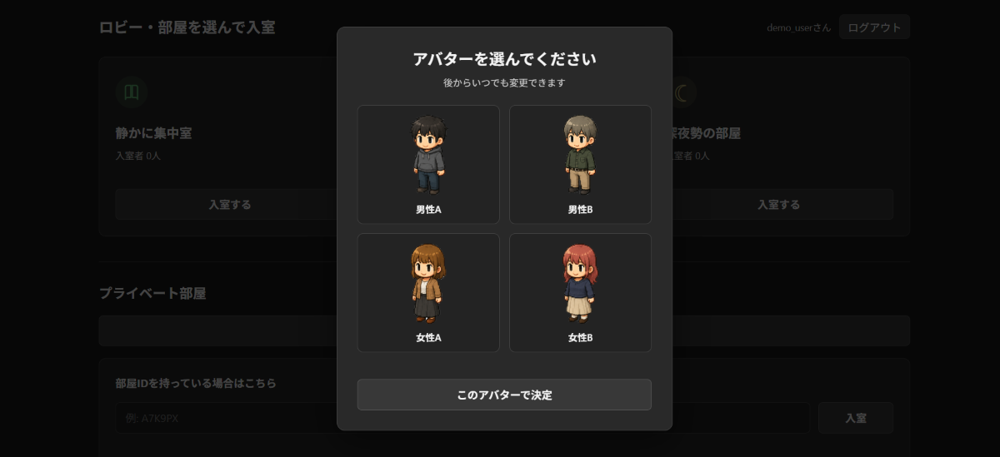
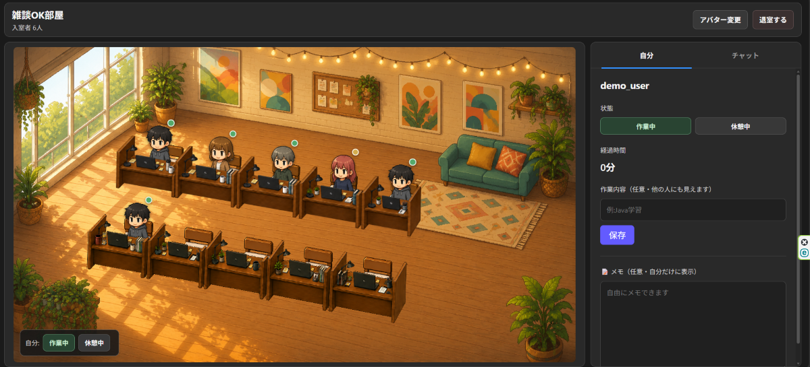
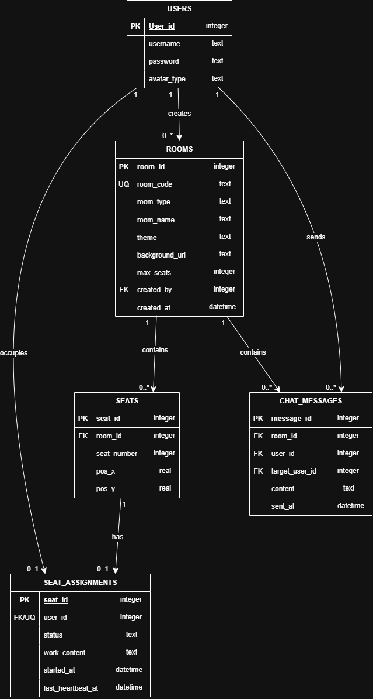
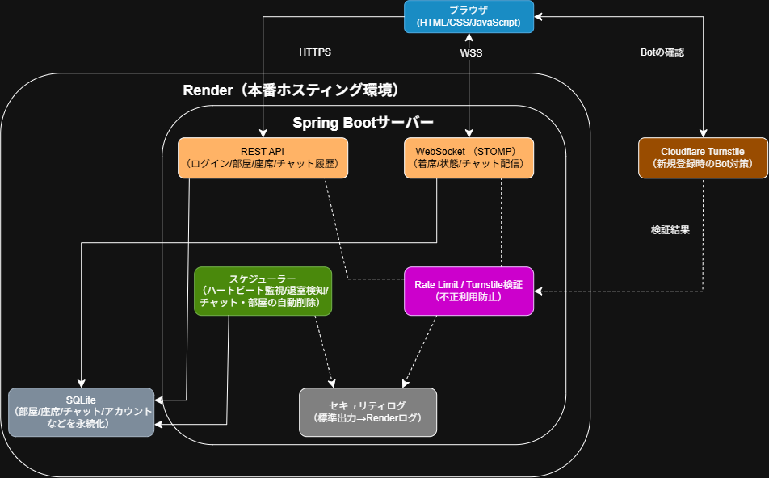
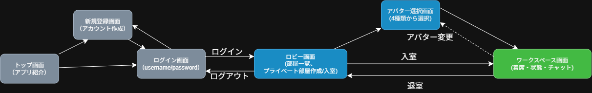

# ワークwith

一緒の空間で、ひとりじゃない作業時間を。



オンライン上でもカフェや図書館のような集中できる環境をつくる、バーチャル共同作業スペースアプリです。アバターで部屋に入室し、他の利用者が作業している気配を感じながら、自分の勉強や仕事を続けられます。

▶ **アプリを試す**：https://work-with.onrender.com/main.html

**テスト用アカウント**
- ユーザーネーム：`demo_user`
- パスワード：`Demo12345`

※ 上記アカウントでそのままログインできます。もちろん、新規登録も数秒で完了するので、ご自身のアカウントを作成しても構いません。

---

## 目次

- [開発した背景](#開発した背景)
- [できること](#できること)
- [画面](#画面)
- [使用技術](#使用技術)
- [ER図](#er図)
- [システム構成図](#システム構成図)
- [画面遷移図](#画面遷移図)
- [セキュリティ対策](#セキュリティ対策)
- [API仕様](#api仕様)
- [ローカル環境での起動方法](#ローカル環境での起動方法)

---

## 開発した背景

在宅での勉強や作業は、誰にも見られていない分だけ気持ちが緩みやすく、孤独感からモチベーションを保ちにくいという課題があります。オンライン上でも「誰かと一緒に作業している」という感覚を再現できれば、この課題を和らげられるのではないかと考え、開発しました。

図書館や自習室をイメージしたイラストの部屋にアバターで入室し、他の利用者の様子（作業中／休憩中、作業内容メモ）が見える形にすることで、ゆるやかな一体感と、適度な緊張感の両方を演出しています。

## できること

- **アバターで入室**：4種類のプリセットアバターから選び、部屋の座席に着席します
- **状態の共有**：作業中／休憩中をワンタップで切り替え、他の利用者にも表示されます
- **作業内容メモ**：今何をしているか（任意）を他の利用者にも共有できます
- **チャット**：部屋全体、または特定の相手への個別チャットが送れます
- **プライベート部屋**：参加コードを知っている人だけが入れる、自分専用の部屋を作成できます
- **部屋間の視点移動**：パブリック部屋に着席したまま、同じテーマの隣の部屋の様子を覗き見できます
- **リアルタイム同期**：入退室・状態変更・チャットは、リロードなしで即座に反映されます
- **満席時の自動増室**：部屋が満席になると、同じテーマの新しい部屋が自動的に作られます

## 画面

| トップ画面 | ログイン画面 |
|---|---|
|  |  |

| ロビー画面 | アバター選択画面 |
|---|---|
|  |  |

### ワークスペース画面



部屋の中の様子がひと目で分かり、着席・状態変更・チャットをこの1画面で行えます。

## 使用技術

| Category | Technology Stack |
|---|---|
| Frontend | HTML / CSS / JavaScript（Vanilla, SPA構成） |
| Backend | Java 21, Spring Boot 3.5, Spring WebSocket (STOMP), Spring JDBC |
| Database | SQLite |
| Bot対策 | Cloudflare Turnstile |
| Infrastructure | Render（Docker） |
| Testing | JUnit 5 |
| Design/Docs | draw.io, Graphviz |

## ER図



- `ROOMS.room_code` を知っている利用者だけが、プライベート部屋に入室できます
- `SEAT_ASSIGNMENTS.last_heartbeat_at` を使い、一定時間反応がない利用者を自動退室させています
- `CHAT_MESSAGES` は送信から24時間、プライベートな `ROOMS` は作成から2週間で自動削除され、データベースの肥大化を防いでいます

## システム構成図



- ブラウザとサーバー間は、通常のAPI通信をREST（HTTPS）、リアルタイム更新をWebSocket（STOMP over WSS）で使い分けています
- 新規登録時はCloudflare Turnstileでbotでないことを確認したうえで、IP単位のRate Limitも併用しています
- 一定間隔で動くスケジューラーが、退室検知（ハートビート監視）と、チャット・部屋の自動削除を担当しています

## 画面遷移図



## セキュリティ対策

- パスワードはBCryptでハッシュ化して保存
- セッションCookieはHttpOnly・Secure属性付き
- 新規登録・ログイン・部屋作成/入室・チャット送信・各種変更操作にRate Limitを設定し、連打・総当たり攻撃を防止
- 新規登録時はCloudflare Turnstileによるbot対策を実施
- Rate Limit発動や不審なアクセスは、個人情報を含めない形（指紋化）でサーバーログに記録
- X-Forwarded-Forヘッダーは、Cloudflare経由時は`CF-Connecting-IP`を優先し、フォールバック時も偽装されやすい先頭値ではなく末尾の値を採用

## API仕様

REST API・WebSocketチャンネルの一覧・詳細仕様は、以下のスプレッドシートにまとめています。

- `docs/API一覧.xlsx`
- `docs/API仕様書.xlsx`

## ローカル環境での起動方法

### 必要環境

- JDK 21
- Git

### セットアップ手順

```bash
# 1. リポジトリをクローン
git clone https://github.com/Nask-gmil/work-with.git
cd work-with

# 2. 起動（初回は依存関係のダウンロードが走ります）
./mvnw spring-boot:run
```

起動後、ブラウザで `http://localhost:8080/main.html` を開くとトップ画面が表示されます。

### 環境変数（任意）

Cloudflare Turnstile（bot対策）を有効にする場合は、以下の環境変数を設定してください。未設定の場合、新規登録APIは503を返して安全側に倒れます。

```bash
export TURNSTILE_SITE_KEY=xxxxx
export TURNSTILE_SECRET_KEY=xxxxx
```

Rate Limitの閾値やデータの保存期間なども環境変数で調整できます。詳細は `src/main/resources/application.properties` を参照してください。
